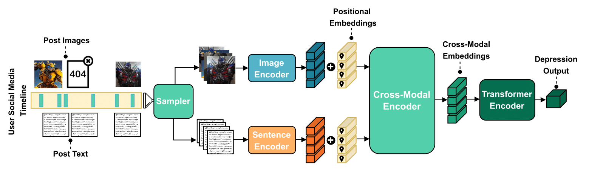
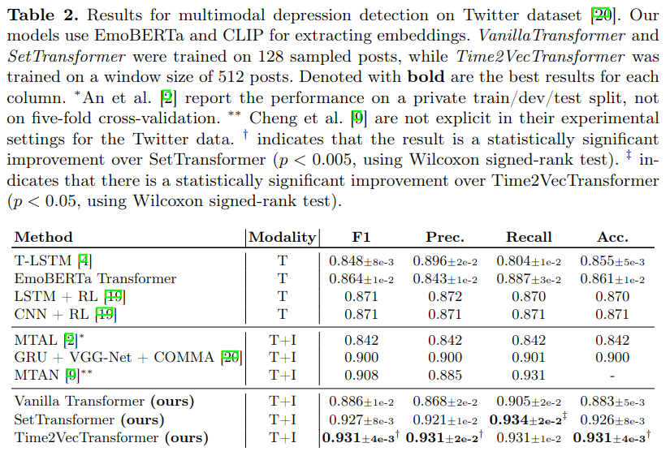
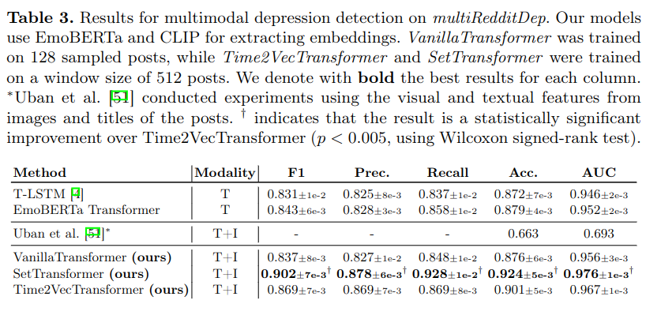
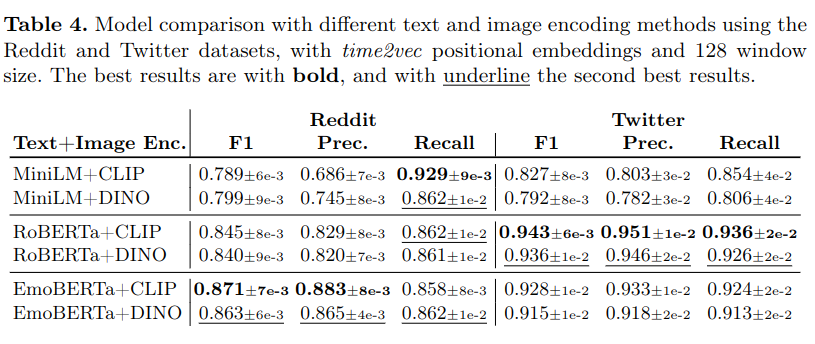

## It’s Just a Matter of Time: Detecting Depression with Time-Enriched Multimodal Transformers
### Ana-Maria Bucur, Adrian Cosma, Paolo Rosso and Liviu P. Dinu

This repository contains the official source code for the paper **"[It’s Just a Matter of Time: Detecting Depression with Time-Enriched Multimodal Transformers](https://link.springer.com/chapter/10.1007/978-3-031-28244-7_13)"**, accepted at the 2023 edition of European Conference on Information Retrieval (ECIR). 

[Presentation Slides](https://docs.google.com/presentation/d/1TmFzbmz93RinKHM246qA4OWO3fuuxYEoZBzBpaISdJM/edit?usp=sharing)

### Abstract
*Depression detection from user-generated content on the internet has been a long-lasting topic of interest in the research community, providing valuable screening tools for psychologists. The ubiquitous use of social media platforms lays out the perfect avenue for exploring mental health manifestations in posts and interactions with other users. Current methods for depression detection from social media mainly focus on text processing, and only a few also utilize images posted by users. In this work, we propose a flexible time-enriched multimodal transformer architecture for detecting depression from social media posts, using pretrained models for extracting image and text embeddings. Our model operates directly at the user-level, and we enrich it with the relative time between posts by using time2vec positional embeddings. Moreover, we propose another model variant, which can operate on randomly sampled and unordered sets of posts to be more robust to dataset noise. We show that our method, using EmoBERTa and CLIP embeddings, surpasses other methods on two multimodal datasets, obtaining state-of-the-art results of 0.931 F1 score on a popular multimodal Twitter dataset, and 0.902 F1 score on the only multimodal Reddit dataset.*



### Data

The Reddit and Twitter multimodal data used in our experiments are from the work of:

Uban, Ana-Sabina, Berta Chulvi, and Paolo Rosso. [Explainability of Depression Detection on Social Media: From Deep Learning Models to Psychological Interpretations and Multimodality](https://link.springer.com/chapter/10.1007/978-3-031-04431-1_13). In Early Detection of Mental Health Disorders by Social Media Monitoring, pp. 289-320. Springer, Cham, 2022.

Gui, Tao, Liang Zhu, Qi Zhang, Minlong Peng, Xu Zhou, Keyu Ding, and Zhigang Chen. [Cooperative Multimodal Approach to Depression Detection in Twitter](https://ojs.aaai.org/index.php/AAAI/article/view/3775). In Proceedings of the AAAI conference on Artificial Intelligence, vol. 33, no. 01, pp. 110-117. 2019.

Please contact the respective authors for accessing the data.

After getting the data, two json files with the dates of the posts need to be created. For generating the files, the scripts  should be used: `scripts/format-reddit-2.py` and `scripts/format-twitter.py`.

### Running experiments

Our model definition can be found in the `models/` folder. The multimodal transformer model is based on [LXMERT](https://github.com/airsplay/lxmert) for the cross-encoder definition. The T-LSTM model is adapted from this [repo](https://github.com/duskybomb/tlstm). Time2Vec positional embeddings are adapted from this [repo](https://github.com/ojus1/Time2Vec-PyTorch).

Experiments used to produce the results from the paper are defined in the bash script in `experiments/run_experiments.sh`.


This repo is based on [acumen-template](https://github.com/cosmaadrian/acumen-template) to organise the project, and uses [wandb.ai](https://wandb.ai/) for experiment tracking.

### Results

Results on Twitter data.



Results on Reddit data.




Comparision between different types of text and images encoders.




### Citation
If you find our work useful, please cite us:

```
@InProceedings{10.1007/978-3-031-28244-7_13,
  author="Bucur, Ana-Maria and Cosma, Adrian and Rosso, Paolo and Dinu, Liviu P.",
  title="It's Just a Matter of Time: Detecting Depression with Time-Enriched Multimodal Transformers",
  booktitle="Advances in Information Retrieval",
  year="2023",
  publisher="Springer Nature Switzerland",
  address="Cham",
  pages="200--215",
  isbn="978-3-031-28244-7"
}
```
